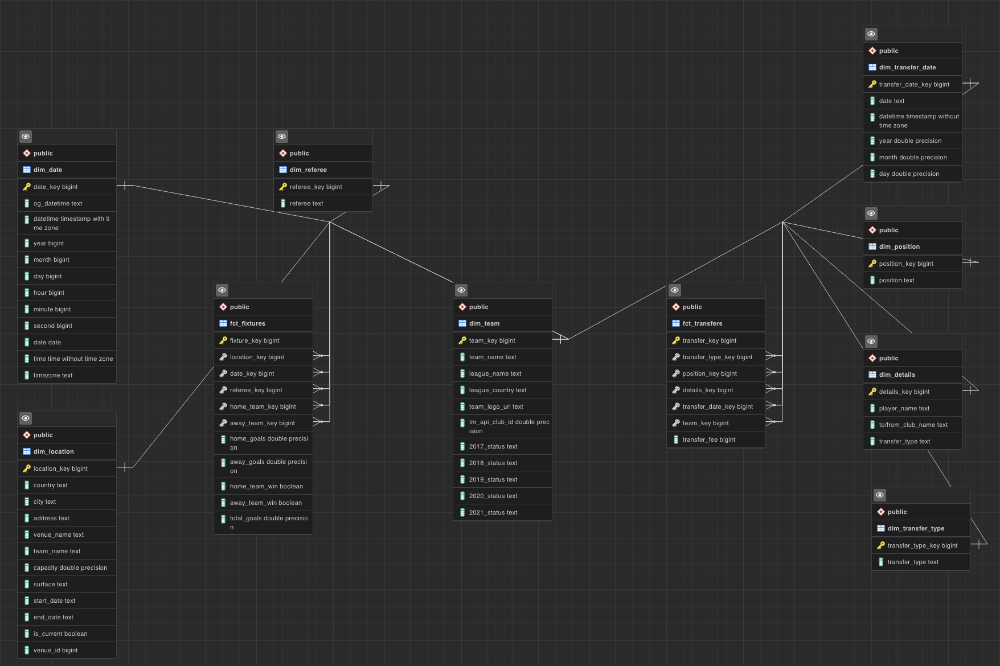
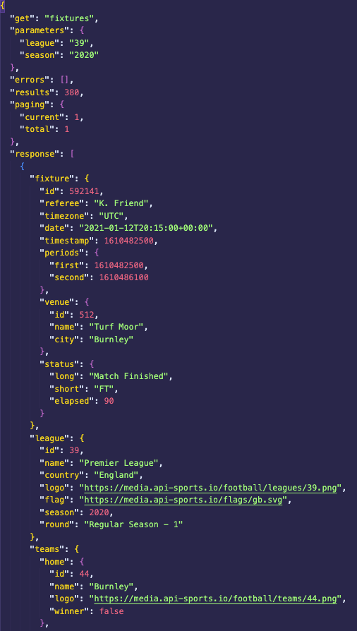
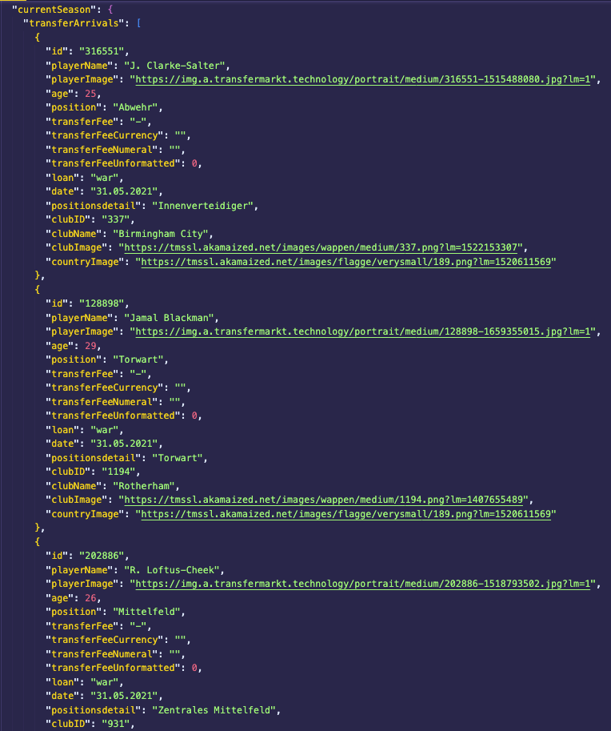
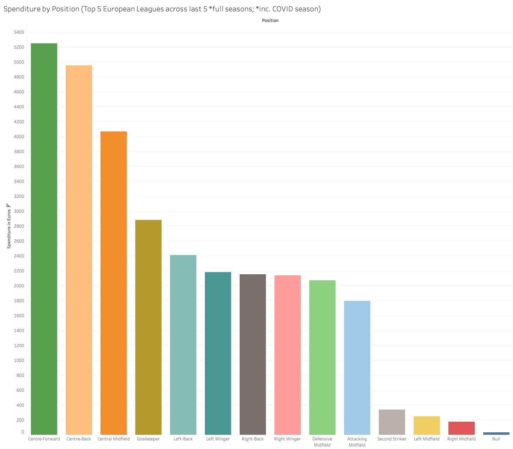
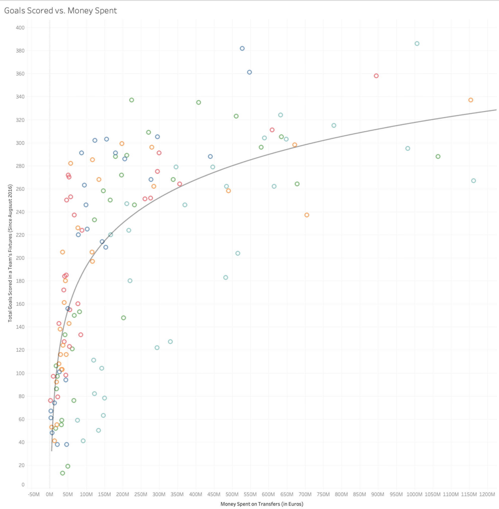

# Constellation Schema DWH of Soccer Data
## European Soccer Fixtures and Transfers
  
DWH containing data from top 5 European leagues for the past 6 seasons.  
The leagues used are: Premier League (England), Serie A (Italy), La Liga (Spain), Bundesliga (Germany), and Ligue 1 (France).  
Since the season of 2022-2023 is still in progress, not all fixtures are present in the DWH (as of December 2022).  

  
This repository contains ETL code for populating and updating a PostgreSQL DWH  
originally made for CS689: Designing and Implementing a Data Warehouse class' term project.  
  
The term project required creating a constellation schema DWH, with *SCD type 2* and *3*.  
To receive full marks, the design demanded at least 2 fact tables.  
  
Data was retrieved from 2 separate APIs: [FOOTBALL API](https://rapidapi.com/api-sports/api/api-football) and [Transfer Market API](https://rapidapi.com/apidojo/api/transfermarket).  
The raw data was in JSON format, with some examples below:  

  
  
The 2 fact tables in the design, **fct_fixtures** and **fct_transfers**, are connected by  
**dim_team** table. Table **dim_location** is *SCD type 2* and table **dim_team** is *SCD type 3*.  
  
The ETL process was performed using Python (in Jupyter Notebooks; required format by the class) and SQL.  
There was an initial ETL process, which populated the DWH with data and a secondary ETL process to update  
with new data. This was done in order to test the *SCD type 2* and *3*.  
  
After the DWH was completed, Tableau was used to make insightful dashboards to provide easily interpretable intelligence.  
The image below shows the amount of money clubs spent on each position:  
  
  
  
This image shows the correlation between the money spent on transfers versus the goals scored for each club.  
Using a logarithmic trendline, an R^2 value of 0.58 was achieved.  
  
  
